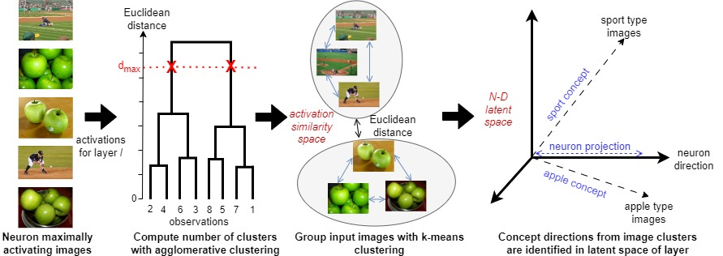

<!-- Improved compatibility of back to top link: See: https://github.com/othneildrew/Best-README-Template/pull/73 -->
<a name="readme-top"></a>
<!--
*** Thanks for checking out the Best-README-Template. If you have a suggestion
*** that would make this better, please fork the repo and create a pull request
*** or simply open an issue with the tag "enhancement".
*** Don't forget to give the project a star!
*** Thanks again! Now go create something AMAZING! :D
-->

This repository contains the main code and link to the datasets necessary to replicate the experiments in the paper "Disentangling Neuron Representations with Concept Vectors" published in CVPR 2023 workshop proceedings. 


<!-- PROJECT SHIELDS -->
<!--
*** I'm using markdown "reference style" links for readability.
*** Reference links are enclosed in brackets [ ] instead of parentheses ( ).
*** See the bottom of this document for the declaration of the reference variables
*** for contributors-url, forks-url, etc. This is an optional, concise syntax you may use.
*** https://www.markdownguide.org/basic-syntax/#reference-style-links
-->


<!-- PROJECT LOGO -->
<br />
<div align="center">
  <a href="https://github.com/lomahony/sw-interpretability">
    
  </a>

  <h3 align="center">Disentangling Neuron Representations with Concept Vectors</h3>

  <p align="center">
    <br />
    <a href="TODO">Paper</a>
    ·
    <a href="TODO">Blog post</a>
    ·
    <a href="TODO">ArXiv</a>
  </p>
</div>


<!-- ABOUT THE PROJECT -->
## About The Project

Breaking down the model into interpretable units allows us to better understand how models store representations. However, the occurrence of polysemantic neurons, or neurons that respond to multiple unrelated features, makes interpreting individual neurons challenging. This has led to the search for meaningful directions, known as concept vectors, in activation space instead of looking at individual neurons. 
We demonstrate our method to disentangle polysemantic neurons into concept vectors consisting of linear combinations of neurons that encapsulate distinct features.


<!-- GETTING STARTED -->
## Usage

To reproduce the results and do further exploration, follow these simple example steps:


### Prerequisites

conda, ImageNet dataset


### Install


1. Clone the repo
   ```sh
   git clone https://github.com/lomahony/sw-interpretability.git
   ```
2. Install packages in a new environment
   ```sh
   conda env create --name sw-interpretability --file environment.yml
   conda activate sw-interpretability
   ```
3. Compute embeddings
   run Compute_Ilsvrc12_Embeddings.ipynb (change source of ImageNet dataset to your save location)
   You can also alter the model and layer to explore further. 

4. Results are found by running Method.ipynb. 
   Explore various neurons and hyperparameters to see how visualisations change in this script!


<!-- CITE -->
## Cite our work

If you make use of the code, please cite the paper in resulting publications.

TODO


<!-- CONTACT -->
## Contact

For questions, please contact Laura O'Mahony - lauraa.omahony@ul.ie

<p align="right">(<a href="#readme-top">back to top</a>)</p>
